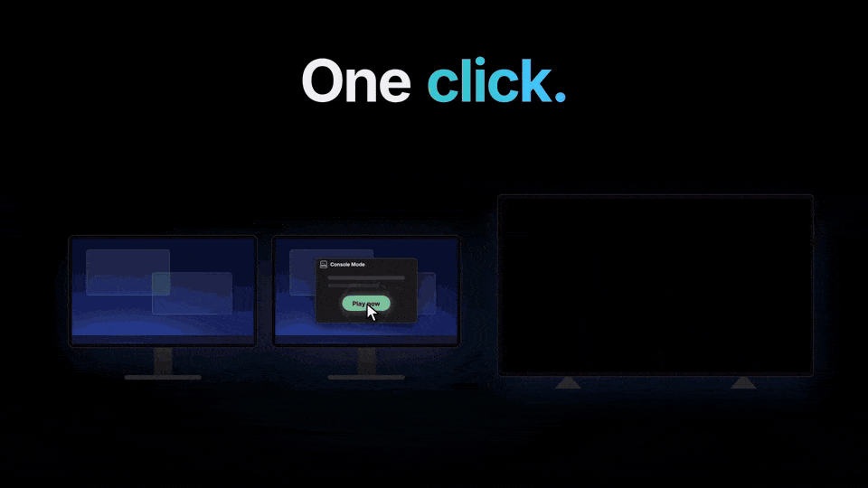

# Console Mode

Turn your Windows PC into a **game console** with one click: focus the TV, turn off the other screens, switch the audio and launch your game UI. Quit the game and your desk comes back on its own.

🇧🇷 [Leia em português](README.pt-BR.md)

## Download

Get **[1.6.0](https://github.com/lippdev/consolemode/releases/tag/v1.6.0)**, the latest stable version:

- **`ConsoleMode-Setup-x64.exe`** (recommended): per-user install, no admin, updates itself.
- **`ConsoleMode-Portable-x64.exe`**: a single exe that keeps its data next to it.
- Or with winget: `winget install lippdev.ConsoleMode`

On 1.5? The app offers the update and keeps your settings; you pick your controller shortcuts again the first time it opens.

Want to try what comes next before everyone else? Turn on Settings → "Receive test versions (alpha and beta)".

Windows 10 or 11, plus [Steam](https://store.steampowered.com/) (Big Picture), [Playnite](https://playnite.link/) or the Xbox app. [RTSS](https://www.guru3d.com/files-details/rtss-rivatuner-statistics-server-download.html) is optional, for the FPS limit and the FPS counter.

## How it works

1. Open the app and pick the screen you play on. The others turn off.
2. Press **Play now**, or use the one-click desktop shortcut. The first time on a new screen, the TV asks "Can you see this screen?" and reverts on its own if nobody answers.
3. Quit Big Picture or Playnite and everything goes back: screens, audio, resolution.

Prefer the couch? With the app in the tray, hold your controller shortcut and it starts from there.

You pick the controller shortcuts yourself: none is on at first, the app asks the first time you open it (and you can change them in Settings). No button can serve two actions.

| Controller shortcut | Does | Suggested |
|---|---|---|
| Hold your **open** shortcut | Enter console mode from the tray | **Home** (Xbox / PS) |
| Hold your **menu** shortcut | Menu over the game: open windows, file explorer, volume, resolution, audio, FPS, HDR, exit | **Select + Y** (Create + △) |
| Hold your **back to the PC** shortcut | Back to the PC | **Start + Select** (Options + Create) |

## Features

- Hide the other screens by **disconnecting** them, **black overlays** or **DDC/CI**, all with Windows' own APIs: no third-party display or audio tool is bundled
- Per-screen **resolution and refresh rate**, **HDR**, **VRR** and an **FPS limit** (RTSS) while you play
- **FPS counter** over the game (RTSS) on a card in three sizes: FPS only, compact (CPU, GPU and RAM usage), detailed (clocks, GPU temperature and memory) or your own layout
- Audio goes to the TV (or any output) and comes back afterwards
- [Turns the TV on and switches it to the PC's input](docs/GUIDE.md#tv-control) (Google TV / Android TV over the network), and can put it in standby afterwards
- Launches **Steam Big Picture**, **Playnite fullscreen** or **Xbox** mode, and sends Steam to the tray when you go back to the PC
- **Session menu** over the game: switch or close the open windows, change volume, resolution, audio, FPS and HDR, and browse your files with [ControlFS](https://github.com/nextestudios/ControlFS)
- Two interfaces: **Desktop** (mouse) and **Console** (full screen, Xbox and PlayStation pads, LB/RB tabs, your Steam covers as the background)
- Automation with `consolemode://start` / `stop` / `menu` links (Stream Deck, scripts) and a [local control API](docs/GUIDE.md#local-control-api)
- English, Portuguese and Spanish

## What's new in 1.6.0

- **Console interface, redesigned:** Home, Session and System tabs on LB/RB, screen tiles, your Steam covers as the background and interface sounds
- **Session menu like Steam's overlay:** full screen over the game, with the open windows in the middle (an Alt + Tab for the controller)
- **File explorer built in:** ControlFS opens from the session menu, and installs from there if it is missing
- **FPS counter** over the game through RTSS, with Compact, Detailed and Custom styles
- **Your shortcuts, your buttons:** pick the controller buttons that open Console Mode, the session menu and the way back to the PC
- **TV control:** turns a Google TV / Android TV on and switches it to the PC's input
- **All the project's own code:** displays and audio through Windows' APIs, without the NirSoft tools
- Steam goes to the tray when you go back to the PC, the desk layout comes back exactly as it was (portrait monitors too), and slow Playnite starts no longer end the session

All the details in the [release notes](https://github.com/lippdev/consolemode/releases/tag/v1.6.0) and the [changelog](CHANGELOG.en-US.md) · [notas em português](CHANGELOG.md).

## Roadmap

**Next:** JoyChromium (the web with a controller, straight from Console Mode), record the last 30 s ([#77](https://github.com/lippdev/consolemode/issues/77)), desktop icon positions ([#30](https://github.com/lippdev/consolemode/issues/30)) · **Later:** per-game profiles ([#69](https://github.com/lippdev/consolemode/issues/69)), more languages ([#14](https://github.com/lippdev/consolemode/issues/14)) · **Exploring:** HDMI-CEC ([#75](https://github.com/lippdev/consolemode/issues/75)), Linux and macOS ([#74](https://github.com/lippdev/consolemode/issues/74)), [and more](https://github.com/lippdev/consolemode/issues?q=is%3Aopen+label%3Aroadmap).

## More

- [Guide](docs/GUIDE.md): modes and restore, control API, HDR/VRR/FPS, troubleshooting, building from source
- **Feedback:** the button next to Settings in the app, or [this form](https://github.com/lippdev/consolemode/issues/new?template=feedback.yml). A ⭐ helps other couch gamers find the project.
- The releases are not code-signed yet, so Windows SmartScreen or an antivirus may warn about the download; the source is all here.

[GNU Affero General Public License v3.0 only](LICENSE) · [Third-party notices](THIRD_PARTY_NOTICES.md) · [Code signing policy](docs/CODE_SIGNING.md)
